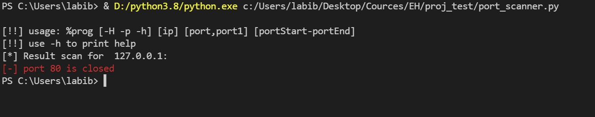
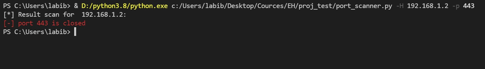
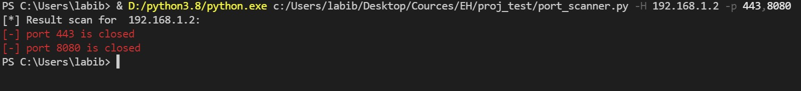
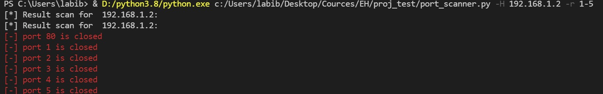
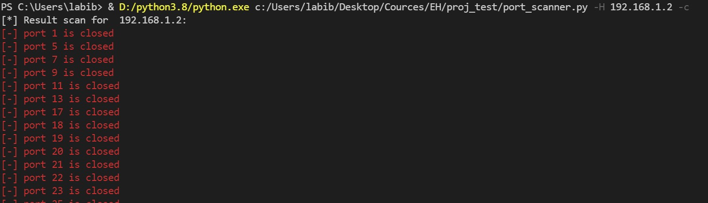

# EH_proj_port_scanner
This program was made as a project for EH course

## Simple Port Scanner
This command-line-based-program will scan ports to check if open or closed, and output the result to the command line.
you can use this prgram to scan one port, a list of ports, or [the top common ports.](https://web.mit.edu/rhel-doc/4/RH-DOCS/rhel-sg-en-4/ch-ports.html#TB-PORTS-WK)
It uses threads to make the scanning process faster.
If the host was passed as a domain name the program will try to map it to the corresponding ip address. 
*If no ip or port were specified as args, the defaults are host=127.0.0.1, port=80.*

## Supported platforms:
- Windows
- Linux   

***Tested on python3.8 and pip 21.1.1***
## Usage

* run the following: `git clone https://github.com/LaKH-exe/EH_proj_port_scanner`
* navigate into the newly cloned directory.
* you can run `pip install -r requirements.txt`, or install them manually when prompted.
* run `python3 port_scanner.py` if you run it without options it will scan the default host and port.
* use option `-H` to specify the host.
* use option `-p` to specify the port.
* you can use option `-p` to scan a list of ports *seperated by commas*.
* use option `-r` to scan a range of ports *seperate the start port and the end port with a dash (-)*
* use option `-c` to scan the common ports.
* ***use `-h` to print help.***

## Screenshots
`python port_scanner.py`  
will scan the defaults

`python port_scanner.py -H <host> -p <port>`  

`python port_scanner.py -H <host> -p <port,port,port>`  

`python port_scanner.py -H <host> -p <port-port>`  

`python port_scanner.py -H <host> -c`  

